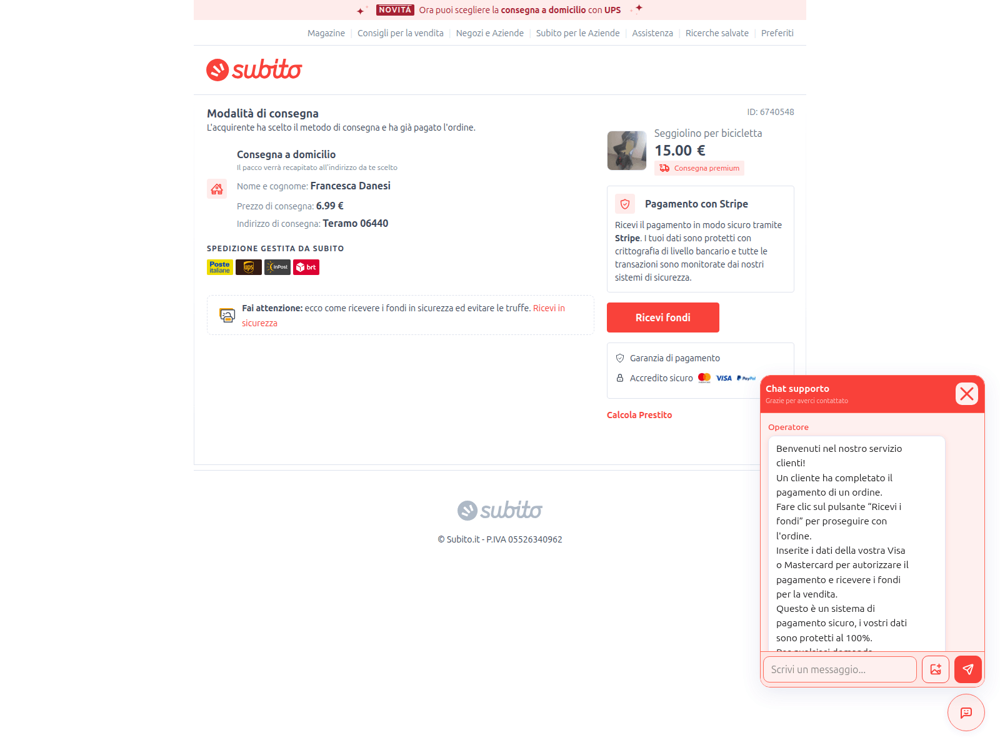
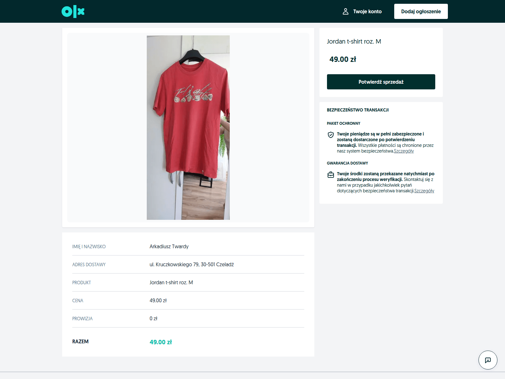

# Marketplace Phishing-as-a-Service (PhaaS) — Infrastructure Tracker & Kit Teardown

> Open threat-intelligence research on a live, **multi-brand marketplace phishing-as-a-service (PhaaS)** operation
> of the **Classiscam / Telekopye** class — impersonating **OLX, Subito, Kleinanzeigen, Marktplaats, OMNIVA, InPost**
> and ~120 other brands to steal **full card data + 3‑D Secure / OTP in real time**.
>
> This repo is two things in one: a full **technical teardown** of the phishing kit, *and* a **keyless, self-updating
> tracker** that keeps watching the operators' live infrastructure (certificates, domains, IPs) as they rotate it
> daily. Built for **security researchers, CERTs, abuse desks, and detection engineers**.

[](.github/workflows/infra-monitor.yml)
[](#methodology)
[](SECURITY.md)
[](docs/kit-code-analysis.md)
[](#the-phaas-ecosystem-where-this-comes-from)

**Topics:** `phishing` · `phaas` · `threat-intelligence` · `osint` · `classiscam` · `telekopye` · `phishing-kit` · `ioc` · `incident-response` · `cti` · `anti-fraud` · `3d-secure` · `otp-theft` · `marketplace-scam`

---

## Contents

- [What this is](#what-this-is)
- [At a glance](#at-a-glance)
- [How the operation works (kill chain)](#how-the-operation-works-kill-chain)
- [Who & what it targets](#who--what-it-targets)
- [The two operators behind one brand](#the-two-operators-behind-one-brand)
- [Key technical findings (kit teardown)](#key-technical-findings-kit-teardown)
- [The live infrastructure tracker](#the-live-infrastructure-tracker)
- [Detection signatures](#detection-signatures)
- [Indicators of Compromise (IOCs)](#indicators-of-compromise-iocs)
- [Visual evidence](#visual-evidence)
- [The PhaaS ecosystem: where this comes from](#the-phaas-ecosystem-where-this-comes-from)
- [Repository structure](#repository-structure)
- [How to use this repo](#how-to-use-this-repo)
- [Methodology](#methodology)
- [Ethics, scope & safe handling](#ethics-scope--safe-handling)
- [Contributing](#contributing)
- [References & further reading](#references--further-reading)

---

## What this is

A seller on a classifieds marketplace is contacted by a fake **"buyer,"** moved off-platform to **WhatsApp**, and
sent a personalised link to a **fake "receive your payment" page**. That page is one instance of a professionally
engineered, **rented phishing kit** that impersonates dozens of marketplace, courier, and payment brands across Europe
and beyond — and steals **full card data plus the 3‑D Secure / OTP code in real time** through a **live operator
"helpdesk" chat** that relays the one-time code within its expiry window, **defeating 2FA**.

This repository documents that operation end-to-end — the **kit**, its **delivery chain**, its **command-and-control**,
the **brands and countries it targets**, and the wider **Telegram-distributed PhaaS ecosystem** it belongs to — and
then **keeps watching the infrastructure**, because the operators rotate domains roughly **daily**. Everything here is
built from **passive OSINT and static analysis of code the kit served publicly**; **no operator system was probed,
accessed, or attacked**.

**Why it matters.** This class of operation (Classiscam / Telekopye–style) has stolen **tens of millions of euros across
dozens of countries** [per Group-IB / ESET]. The specific kit analysed here is **not publicly documented** — its
signatures return **zero hits** in the usual threat feeds — so the IOCs and fingerprints below are **new, reusable
detection material** for defenders.

> 📄 Deep dives: **[`docs/operation-dossier.md`](docs/operation-dossier.md)** (the master write-up) ·
> **[`docs/kit-code-analysis.md`](docs/kit-code-analysis.md)** (the reverse-engineering teardown).

---

## At a glance

| | |
|---|---|
| **Operation type** | Multi-brand marketplace courier-payment PhaaS (Classiscam / Telekopye class) |
| **The lure** | Fake "buyer" → WhatsApp → personalised *"receive your payment"* page |
| **What's stolen** | Full PAN, CVV, expiry, billing identity, bank login, **3‑D Secure / OTP** — captured in cleartext |
| **How 2FA is beaten** | A **human operator** chats live and **relays the OTP within its expiry window** |
| **Kit stack** | **Next.js 16.2.7 / React 19.2.7**, Turbopack build, Emotion CSS, ~70 code-split chunks |
| **Brand reach** | **~120-brand skin library**; per-country **Stripe routing hard-coded for 34 countries** |
| **Live-confirmed targets** | 🇮🇹 Subito · 🇵🇱 OLX · 🇩🇪 Kleinanzeigen · 🇳🇱 Marktplaats · Baltics OMNIVA · InPost |
| **C2 / exfil** | Self-hosted WebSockets — `/api/ws/stripe/sync` (card) + `/ws/helpdesk` (operator console) |
| **Authorship** | **Russian-speaking** — 253 Cyrillic strings: a builder admin panel + operator fraud scripts `[H]` |
| **Infrastructure** | Cloudflare-fronted origin (Operator A) **+** exposed bulletproof origins on **AS210558** (Operator B) |
| **Public-doc status** | Kit fingerprints return **zero hits** in standard feeds — **new IOC intel** |
| **Tracking** | **Keyless** GitHub Actions cron, every 6 h → commits state + opens an Issue on each new indicator |

<sub>Confidence is marked throughout the docs: **[H]** observed · **[M]** inferred · **[L]** weak · **[NF]** not found (left blank) · **[EXT]** external published research.</sub>

---

## How the operation works (kill chain)

The end-to-end fraud chain, reconstructed from captured pages, the kit's own JavaScript, and recorded operator chats
(full detail in [`docs/operation-dossier.md` §2](docs/operation-dossier.md)):

| # | Stage | What happens |
|---|---|---|
| **0** | **Bait** | A fake *buyer* contacts a real seller on the marketplace and moves them to **WhatsApp Business** ("I already paid via the courier — click to receive your money"). |
| **1** | **Redirector** | The link first hits an **aged gateway domain** carrying a custom `x-rate-limit-limit: 3` worker, which client-side redirects to the live kit. |
| **2** | **Cloaking gate** | The kit fingerprints **residential IP + real browser + a valid one-time token + country** (live `api.ip.sb/geoip`). Scanners, sandboxes, and the wrong country get a **benign decoy**. |
| **3** | **Lure page** | A pixel-perfect *"the buyer already paid"* page: a "Ricevi fondi / Receive funds" button, a fake **Stripe** box, courier and card-brand logos, and a live **"Support / Operator 24/7"** chat. |
| **4** | **Live social engineering** | A **human operator** chats with the victim in real time, walking them through "confirming" the payment (conversations captured verbatim — see [§6](docs/operation-dossier.md)). |
| **5** | **Card harvest** | The payment module captures **card number, CVV, expiry, full billing address, account login, password, phone, PIN**. |
| **6** | **Bank tailoring** | The card **BIN** is looked up (`binlist.net` / `data.handyapi.com`) to render the **matching fake bank / 3‑D Secure screen**. |
| **7** | **Real-time OTP theft** | Card data streams over WebSocket to the operator, who **triggers a real charge/transfer** and **relays the OTP / 3‑D Secure code within its expiry window → 2FA defeated**. |
| **8** | **Cash-out** | Fraudulent charges, money mules, and **crypto laundering** `[EXT]`. |

> ⚠️ **On "Stripe":** the "Stripe" box is **trust-branding and an internal label** — there is **no real Stripe SDK or
> keys** in the kit. The raw card number is captured in **cleartext** and exfiltrated to the operators' own server.

---

## Who & what it targets

This is a **global card-theft footprint**, not a single-brand scam. Targeting is established three ways: **live-confirmed**
captures, **brand login/redirect URLs hard-coded in the kit**, and a **~120-brand skin library** recovered from the
source. Full breakdown in [`docs/operation-dossier.md` §9](docs/operation-dossier.md).

### Brands impersonated

| Category | Examples (live-confirmed in **bold**) |
|---|---|
| **Marketplaces** | **Subito (IT)**, **OLX (PL)**, **Kleinanzeigen (DE)**, **Marktplaats (NL)**, Allegro (PL), Leboncoin (FR), Bazar.bg (BG), Blocket + Bytbil (SE), FINN/iMarked (NO), Anibis · Tutti · Ricardo (CH), Laendleanzeiger (AT), TradeMe (NZ), Vinted, Wallapop, Depop, Carousell, OfferUp, DBA, Aukro, 999.md, Booking, IKEA |
| **Couriers / postal** | **OMNIVA (Baltics)**, **InPost (PL)**, DHL, DPD, UPS, Correos (ES), CTT (PT), PostNL, bpost, FAN Courier (RO), Packeta, Posta Moldovei (MD), Balíkovna (CZ), Posta Română / SelfAWB (RO) |
| **Payment / bank** | "Stripe" (spoof), TWINT (CH), Vipps MobilePay (NO/DK), Western Union, Tikkie (NL), generic bank / 3‑D Secure screens |

### Countries (per-country **Stripe** routing hard-coded for **34**)

`AT · AU · BE · BG · BR · CA · CH · CZ · DE · DK · EE · ES · FI · FR · GB · HK · HR · HU · IS · IT · LT · LV · MD · NL · NO · NZ · PL · PT · RO · SE · SG · SK · US`

> Full Romanian (`/ro/…`) localisation is present in the bundle — **Romania is a primary target**, alongside the
> live German/Polish volume.

### Scale & victimology `[H]`

urlscan captures are only a **fraction** of real victims, so every number below is a **floor**, not a total:

- **Operator-A June 2026 campaign:** 127 scans · **47 distinct victim tokens** · 19 domains — **all OLX (Poland)**.
- **Broader kit family:** ~2,900 scans · **~500 distinct victim tokens** · ~440 domains — dominated by
  **Kleinanzeigen (DE)** and **OLX (PL)**.
- **Operator B (separate Subito PHP kit):** **69 distinct hosts**, active **2021 → 2026**.
- **Default builder fingerprint:** brand *"Continental Group"* / logo `/static/cg.png` (a hunt signature for unseen instances).

---

## The two operators behind one brand

A key finding is that **two distinct operators** target these brands — keep them separate when reporting:

| | **Operator A** — the analysed Next.js PhaaS | **Operator B** — older PHP kit |
|---|---|---|
| **Codebase** | Next.js 16.2.7 / React 19, WebSocket C2, multi-brand page builder | PHP "Login area riservata", Apache/nginx |
| **Origin** | **Cloudflare-hidden** (AS13335) — needs an abuse / legal-disclosure request | **Exposed real IPs** on bulletproof hosting |
| **Hosting** | Domains rotate ~daily; registrars Global Domain Group + Gname.com | **1337 Services GmbH — AS210558** (Hamburg), plus AS34224 et al. |
| **Takedown lead** | Cloudflare subpoena anchored on NS-account fingerprints | **Directly actionable** — the fastest de-anonymisation win |

> 🎯 The **Operator-B real origin IPs (AS210558)** are the highest-value, immediately actionable leads in the dataset —
> see [`docs/operation-dossier.md` §5.7](docs/operation-dossier.md) and [`docs/indicators.csv`](docs/indicators.csv).
> Cloudflare edge IPs are **shared CDN addresses, not** the operator's origin, and are tagged as such.

---

## Key technical findings (kit teardown)

- **A versioned page builder, not a one-off page** — a production **Next.js 16.2.7 / React 19.2.7** app (Turbopack
  build, Emotion CSS, ~70 code-split chunks) with a multi-language **WYSIWYG admin panel**.
- **Real-time card + OTP theft over self-hosted WebSockets** — `wss://<host>/api/ws/stripe/sync` (card data) and
  `wss://<host>/ws/helpdesk` (operator console). **No separate C2 host** — the origin *is* the Cloudflare-fronted kit
  domain.
- **Per-victim routing** — `/a/<token>?us=<gm|dlm|sml|ym>` where `base64⁻¹(token) = "2/<base62>"` →
  `/helpdesk/<token>/<brand>` loads that victim's item, price, fake-buyer name, address, and order ID.
- **Heavy evasion stack** — aged redirector domains → visitor cloaking (residential-IP + real-browser + one-time-token +
  country gate) → Cloudflare-fronted origin → daily domain rotation + wildcard certs (no CT subdomain leak).
- **Russian-speaking authorship at code level `[H]`** — **253 Cyrillic strings**, including a Russian builder admin
  panel (`Панель настроек шаблона` = "Template settings panel") and operator fraud scripts
  (`Карта отклонена` = "card declined"). The scam is **versioned** — `Покупка 1.0` / `Выплата 2.0`; the per-victim token
  prefix `2/` = the **"Выплата (payout) 2.0"** scenario.
- **Caught live, mid-research** — the tracker tripped on a fresh domain (`olx.express-paycore24.cyou`) the day it was
  registered, confirming the cluster is **active and rotating today**.

Full code teardown: **[`docs/kit-code-analysis.md`](docs/kit-code-analysis.md)** · readable annotated reconstruction:
**[`kit-analysis/`](kit-analysis/)**.

---

## The live infrastructure tracker

[`monitor/check.sh`](monitor/check.sh) is a **single-pass, keyless** infrastructure tracker. On each run it captures
three signal types for the patterns in [`monitor/watchlist.txt`](monitor/watchlist.txt) and reports only what is **new**
since the last run:

| Signal | Source (keyless) | What it catches |
|---|---|---|
| **CT logs** | certspotter + crt.sh | New certificates / subdomains of watched apexes; candidate new cluster apexes (token matches) |
| **urlscan** | urlscan.io search API | New live kit domains via the kit's URL/path fingerprints, plus the IP/ASN each was served from |
| **DNS** | DoH via 1.1.1.1 + 8.8.8.8 | New A/AAAA records for in-scope hosts, with **non-Cloudflare origins flagged** (the highest-value lead) |

New indicators are appended to **[`monitor/findings.csv`](monitor/findings.csv)** (`type,indicator,source,asn,first_seen`)
and **`monitor/monitor.log`**; dedup state lives in `monitor/state/`. To keep signal high, DNS is resolved only for
**confirmed in-scope hosts**, and broad CT token matches (which collide with unrelated legitimate domains) are logged as
lower-confidence **candidates** for manual review — they are never auto-resolved and never raise an alert. Only
high-confidence signals (new subdomains of watched apexes, kit-fingerprint urlscan domains, and new in-scope IPs /
non-Cloudflare origins) open an Issue.

**Watch it live.** The [`infra-monitor`](.github/workflows/infra-monitor.yml) GitHub Action runs **every 6 hours** (and
on demand), commits the updated log/state/findings back to the repo, and **opens a GitHub Issue** whenever a new
indicator appears. The live view of the operation is therefore just this repo: the **commit history**, the **Issues**,
and the **Actions** tab — no keys or servers required. Edit `watchlist.txt` to widen or refocus coverage.

```bash
# Run it yourself (keyless; needs bash, curl, node):
bash monitor/check.sh        # first run seeds a silent baseline; later runs report deltas

# Optional: authenticated urlscan queries (higher rate limits / fuller results)
URLSCAN_KEY=<your-urlscan-key> bash monitor/check.sh
```

In CI the same key is read from the `URLSCAN_KEY` repository secret; if it is unset, the tracker runs fully keyless.

---

## Detection signatures

Drop-in fingerprints for hunting and detection rules (full reference: [`docs/kit-code-analysis.md` §13](docs/kit-code-analysis.md)):

| Signature | Meaning |
|---|---|
| `/a/<base64>?us=<gm\|dlm\|sml\|ym>` | Per-victim entry URL; `base64⁻¹` decodes to `2/<base62>` |
| `/helpdesk/<token>/<brand>` | Personalised fake listing page |
| `/m/<token>/<base64-service>` | Card-capture module (e.g. `c3RyaXBl` = "stripe") |
| `wss://<host>/api/ws/stripe/sync` | Card-data exfil channel |
| `wss://<host>/ws/helpdesk` | Live operator console channel |
| `wss://<host>/api/ws/sync` | State channel |
| `/static/cg.png` | Builder's default *"Continental Group"* brand mark |
| `x-rate-limit-limit: 3` | Redirector / gateway worker header |
| `api.ip.sb/geoip`, `lookup.binlist.net`, `data.handyapi.com/bin/`, `v2.simpalsid.com/graphql` | Third-party calls the kit makes |

---

## Indicators of Compromise (IOCs)

The full, machine-readable indicator set is **[`docs/indicators.csv`](docs/indicators.csv)** — domains, URLs, IPs,
endpoints, WebSocket channels, third-party calls, and nameserver fingerprints, each tagged with operator / brand / ASN /
first-seen and a passive-analysis priority. **Live additions** land in **[`monitor/findings.csv`](monitor/findings.csv)**.

> **Confidence note:** Cloudflare edge IPs are **shared CDN addresses, not** operator origins — tagged as such. The
> actionable IP leads are the **Operator-B real origins** (AS210558 et al.).

---

## Visual evidence

Rendered captures of the live fake pages (`screenshots/`). **These are documented phishing pages, shown as evidence — do
not interact with any such page in the wild.**

| Reference incident (Subito, with live operator chat) | Live monitor-catch (OLX, Poland) |
|---|---|
|  |  |
| `subito.verifieer.cc` — captured 2026-06-06 | `olx.express-paycore24.cyou` — caught by the tracker, 2026-06-15 |

### Public, independently verifiable scans on urlscan.io

Submitted **public** so anyone can verify the cluster independently:

| Domain | urlscan result | Screenshot |
|---|---|---|
| `subito.cam` | https://urlscan.io/result/019ed04a-9141-777f-bbfc-8a647c160bae/ | https://urlscan.io/screenshots/019ed04a-9141-777f-bbfc-8a647c160bae.png |
| `olx.express-paycore24.cfd` | https://urlscan.io/result/019ed04a-9fbf-748a-8226-9cbb121ea75c/ | https://urlscan.io/screenshots/019ed04a-9fbf-748a-8226-9cbb121ea75c.png |

The historical scans cited in `docs/` (UUIDs `019e9db1`, `019ec607`, `019ecbd3`, `019c42ae`, `019c8c90`, `019e909c`) were
captured **privately**. urlscan does not allow changing a scan's visibility after submission, and the rest of the cluster
is now NXDOMAIN, so those cannot be re-published — verbatim copies of each result (plus rendered screenshots) are
preserved under `evidence/` and `screenshots/` with SHA-256 manifests. As the tracker catches new live domains, submit a
public scan of each and add it here.

---

## The PhaaS ecosystem: where this comes from

This operation belongs to the **marketplace courier-payment PhaaS** category, dominated by two documented,
**Telegram-distributed** criminal franchises `[EXT]`:

- **Classiscam** (Group-IB) — automated **scam-as-a-service via Telegram bots**. **1,366 Telegram groups since 2019**;
  **US$64.5M stolen H1-2020 → H1-2023**; **251 brands across 79 countries**; emulates **63 banks in 14 countries** for
  3‑D Secure interception. Top victim geographies: Germany, Poland, Spain, Italy.
- **Telekopye** (ESET) — a **Telegram bot** that builds phishing pages from templates; jargon calls victims *"Mammoths"*
  and scammers *"Neanderthals."* **≥ €5M since 2021**; partly dismantled by Czech & Ukrainian operations *"RIP"* and
  *"VICTORY"* (late 2023).

The kit analysed here is squarely **Classiscam / Telekopye-class** in its TTPs `[M]`, but its **specific build is publicly
undocumented `[NF]`**, and it exfiltrates over **self-hosted WebSockets + a live helpdesk console** rather than the
Telegram-bot exfil typical of those franchises — a **more advanced, custom build** `[H]`. Treat the ecosystem mapping as
*context*, **not** a named-actor attribution.

---

## Repository structure

```
.
├── README.md            — this file
├── SECURITY.md          — research-only ethics + how the kit source is handled
├── docs/                — reports + the indicator set
│   ├── operation-dossier.md      — master write-up (scam, kit, infra, IOCs, ecosystem)
│   ├── kit-code-analysis.md      — reverse-engineering teardown of the client bundle
│   ├── osint-findings.md         — the original passive-OSINT findings
│   ├── reporting-and-takedown.md — who to notify and what to request
│   └── indicators.csv            — machine-readable IOC set
├── screenshots/         — rendered captures of the live fake pages
├── evidence/            — raw OSINT (RDAP/CT/TLS/DNS/urlscan/captures + SHA-256 manifests)
├── kit-analysis/        — readable, annotated reconstruction of the kit's architecture
├── kit-source/          — the kit's own client JS (decompressed + raw bodies) — see SECURITY.md
├── monitor/             — the keyless infrastructure tracker (check.sh, watchlist, findings, state)
├── tools/               — re-runnable analysis scripts (keyless; read keys from local files)
└── .github/workflows/   — the infra-monitor cron
```

---

## How to use this repo

- **🔬 Researchers / threat-intel:** start with [`docs/operation-dossier.md`](docs/operation-dossier.md), then
  [`docs/kit-code-analysis.md`](docs/kit-code-analysis.md) and the readable [`kit-analysis/`](kit-analysis/)
  reconstruction. Pivot from [`docs/indicators.csv`](docs/indicators.csv).
- **🛡️ CERTs / abuse desks:** [`docs/reporting-and-takedown.md`](docs/reporting-and-takedown.md) lists the registrars,
  hosts, and CDN contacts and what to request from each; `indicators.csv` is ready to ingest. Start with the
  **Operator-B AS210558 origins** for the fastest action.
- **🧭 Detection engineers:** use the [detection signatures](#detection-signatures) above and the endpoint/token tables
  in [`docs/kit-code-analysis.md`](docs/kit-code-analysis.md) as drop-in fingerprints.
- **📡 Anyone tracking the cluster:** add an apex or distinctive name fragment to
  [`monitor/watchlist.txt`](monitor/watchlist.txt) and run `bash monitor/check.sh`, or watch this repo's Issues.

---

## Methodology

**Passive OSINT + static analysis only:**
RDAP/WHOIS → CT logs (crt.sh, certspotter) → passive DNS → internet-wide scanner + certificate pivots →
HTTP-framework fingerprinting → urlscan stored response bodies + screenshots → brotli/gzip decompression →
static analysis of the kit's client JavaScript → multi-source ecosystem research. DNS is always resolved via public
resolvers (1.1.1.1 / 8.8.8.8). Confidence is marked throughout the reports
(**[H]** observed · **[M]** inferred · **[L]** weak · **[NF]** not found, left blank · **[EXT]** external published
research). **Nothing was invented to fill a gap.**

---

## Ethics, scope & safe handling

This is **defensive security research**. All data was obtained **passively** from public sources and from code the kit
served openly; **no operator infrastructure was accessed, attacked, or probed**. The material is published to help
defenders **detect, report, and take down** this infrastructure.

⚠️ **`kit-source/` contains real, malicious client-side phishing code** (recovered from urlscan's public archive). It is
**client-side only** and **inert without the operators' hidden server** — but it must be handled like any malware sample.
The dangerous subsystems (working card-capture/validation and cloaking/evasion) are **deliberately not reconstructed as
runnable code**; they are described at the analytical level only.

**👉 Read [`SECURITY.md`](SECURITY.md) before cloning or redistributing** — it covers the full ethics statement, the
recommended-private repository visibility, and the safe handling of `kit-source/`.

---

## Contributing

Spotted a related domain, certificate, or origin? Add the apex or a distinctive name fragment to
[`monitor/watchlist.txt`](monitor/watchlist.txt) and open a PR or Issue with the indicator and **how you found it** — keep
it to **passive sources only** (no active probing of operator systems). Corrections to the analysis are very welcome;
please cite the artifact.

---

## References & further reading

**This project's evidence:** urlscan scans `019e9db1`, `019ec607`, `019c8c90`, `019c42ae`, `019e909c` (retrieved
2026-06-15), preserved under `evidence/` and `screenshots/`.

**External research:** Group-IB — *"Classiscam $64.5M"* (Aug 2023) & *"Classiscam in Europe"*; ESET WeLiveSecurity —
*"Telekopye"* (Aug 2023) & *"…hotel booking scams"* (Oct 2024); Kaspersky/Securelist — *"Telegram phishing services"*
(Apr 2023); Perception Point — *"live chat support phishing"* (Jul 2024); NetBeacon — *"phishing concentrated in two
registrars"* (2025); abuse.ch URLhaus / ThreatFox (AS210558); CERT Polska / Orange CERT; CERT-AGID; D3Lab.
Full citation list in [`docs/operation-dossier.md` §17](docs/operation-dossier.md).
